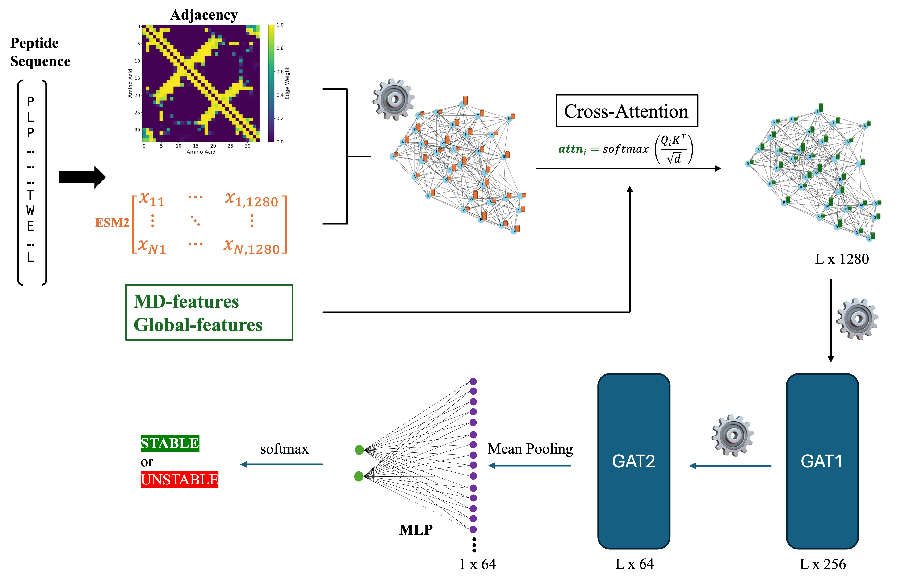

# StabiGAT

## The Idea 

This is a small side project that I developed in my free time and continue to work on whenever I have time.

I implemented a graph neural network (GNN) to predict the thermostability of $\beta$-sheet peptides by integrating structural, sequence-based, and simulation-derived features. For each peptide, a 3D structure was first predicted using ColabFold and subsequently subjected to 30 ns molecular dynamics simulations in explicit solvent using GROMACS with the AMBER99SB-ILDN force field. From these simulations, multiple global stability descriptors were extracted, including RMSD, radius of gyration, solvent-accessible surface area (SASA), hydrogen-bond counts, Lennard–Jones contacts, and potential energy, capturing dynamic aspects of peptide stability.  

In parallel, residue-level representations were generated using ESM2 protein language model embeddings, providing contextual sequence information for each amino acid. Each peptide was then represented as a graph where nodes correspond to residues and edges were derived from an MD-based adjacency matrix reflecting persistent spatial contacts during the simulation. These local embeddings and global MD features were fused via a cross-attention mechanism and processed by multiple Graph Attention Network (GAT) layers to predict whether a peptide is thermally stable or unstable.

## References 

## Third-party licenses

This project uses the packages:

- [pytorch_geometric](https://pytorch.org/get-started/locally/)
- [scikit-learn](https://scikit-learn.org/stable/)

  
MIT License

  

    Permission is hereby granted, free of charge, to any person obtaining a copy
of this software and associated documentation files (the "Software"), to deal
in the Software without restriction, including without limitation the rights
to use, copy, modify, merge, publish, distribute, sublicense, and/or sell
copies of the Software, and to permit persons to whom the Software is
furnished to do so, subject to the following conditions:

The above copyright notice and this permission notice shall be included in all
copies or substantial portions of the Software.

THE SOFTWARE IS PROVIDED "AS IS", WITHOUT WARRANTY OF ANY KIND, EXPRESS OR
IMPLIED, INCLUDING BUT NOT LIMITED TO THE WARRANTIES OF MERCHANTABILITY,
FITNESS FOR A PARTICULAR PURPOSE AND NONINFRINGEMENT. IN NO EVENT SHALL THE
AUTHORS OR COPYRIGHT HOLDERS BE LIABLE FOR ANY CLAIM, DAMAGES OR OTHER
LIABILITY, WHETHER IN AN ACTION OF CONTRACT, TORT OR OTHERWISE, ARISING FROM,
OUT OF OR IN CONNECTION WITH THE SOFTWARE OR THE USE OR OTHER DEALINGS IN THE
SOFTWARE.

